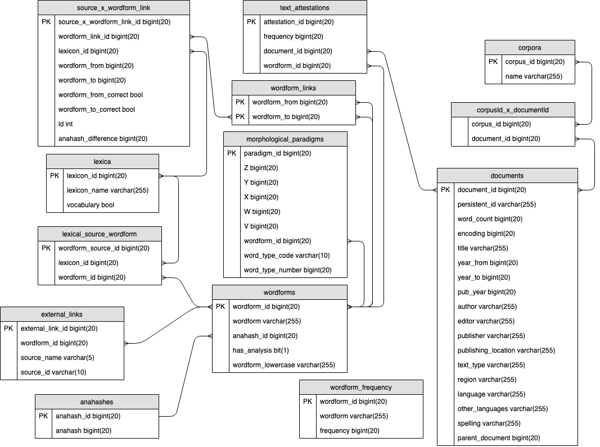

# Database design



(Diagram was created using draw.io - diagram file can be found in the `diagrams` directory.)

## Use cases

* Spelling normalization
	- Facilitates searching for spelling variants
* Spelling modernization
	- To get better performance when using existing nlp tools that have been
	  developed using contemporary corpora
* OCR post correction
	- Get text as close to the original text as possible
	- Get modernized/normalized text
* Spelling correction

## Example/benchmark queries

### Most important queries (these should be fast)

* Given a wordform, give word frequencies per year
* Given a wordform, in what corpora does it occur, with what frequencies

### Other ideas

* Aggregate over words in corpus (or arbitrary selection of texts)
	- Word frequency list
	- Tf idf(?)
	- Reconstruct document(?)
	- ... (we need some realistic stuff here!)
* Give me all word(forms) that are related to this word(form)
	- Show occurrence of the word and/or related words over time (area chart with frequencies over time)
	- The data retrieved can be used to answer the question: is this a (valid, acceptable) word(form)?
* Text reuse(?) (probably not realistic)
	- Find reused passages (of certain length) in other texts
* Find duplicate documents(?)

## Requirements

* Store anagram hashes of word forms
	- Makes it possible to link
	- Makes it possible to find all occurring wordforms for a given anagram value
* Store all possible anagram values of a wordform for a given alphabet and edit distance
	- Makes it possible to link wordforms if a new wordform is encountered/added to the database

## Design decisions

* Take INL lexicon database structure as starting point
	- Reuse:
		- Document/corpora structure can be reused
		- Lexical source structure can be reused
			- We probably need to take into account metadata (time, location) for sources like this, but we ignore it for the time being.
		- Worform
			- Both the 'correct' and 'incorrect' wordforms are added to the wordform table. Incorrect wordforms can come from spelling correction lists and documents.
				- Also, any source can (and will!) contain errors
		- Text Attestation structure can be reused
	- Not (re)used:
		- We don't use the lemma-structure, because it contains information that cannot be automatically derived with high enough quality for historical text - we are not going to do this by hand
		- type_frequency is removed, because it contains the same information as text_attestations, and is used when annotating documents (IMPACT lexicon document 3.0 page 17)
		- analysed_wordform is removed. We don't use it.
		- token_attestations: We ignore word position in the documents, because we don't need it
* Ignore capitals (all word(forms) are lowercase(d))
	- In practice, TICCL already lowercases all text (as a preprocessing step)
* Add table with anahash values
	- id (primary key)
	- wordform_id
	- anahash (indexed)
* Add table for links between wordforms (wordform_link)
	- Does not contain the relations based on edit distance, because this can be calculated on the fly
	- In a later stage we may need to add this type of link explicitly
	- Aligned gold standard and OCR text is treated as spelling correction list (lexicon source)
	- Table structure:
		- id (primary key)
		- wfid1
		- wfid2
* Add table for links between sources and wordform_links ()
	- id (primary key)
	- wordform_link_id
	- source_id (source is lexicon)

## Issues

* Some lexicons contain capitalized wordforms, do we ignore capitalization?
	- Link wordforms with two hashes (one for capitalized, one for lowercased)
	- Only use lowercased and lowercase wordforms before storing them in the database
* Some lexicons contain noisy wordforms, e.g., `te(g)en`, and ticcl normally cleans those using ticcl-unk. How to deal with these forms?
	- Hash them as they are
	- Only add cleaned wordforms
* Spelling correction lists contain correct (valid) and incorrect (invalid) wordforms, should we store both? Probably, yes. All wordforms (both correct ones and incorrect ones) should be connected to this lexicon.
* Bidirectional self-referential relationships in ORM are complicated:
	- https://docs.sqlalchemy.org/en/latest/orm/join_conditions.html#self-referential-many-to-many-relationship
	- https://groups.google.com/forum/#!msg/sqlalchemy/Y18J7jHHJlg/f5ydw1T4gloJ
	- It seems they only work in ORM when the two relationships between the objects have different names (e.g., left nodes and right nodes)
	- Do we need the bidirectional relationship in ORM?
		- This means that if you have get a wordform from the database, you can get all its related words by looking at the `links`.
		- To me it seems just as easy to create a method that does two mysql queries whenever you need to get all related wordforms and then merge the results.
	- Use case: we want to add a `wordform_link` for a new lexicon, we need to check whether the relationship is already in the database.
		- If it is, we need to select it, and add an entry to `source_x_wordform_link`
		- If it isn't, we need to add the link and then add an entry.
		- Checking to see whether it exists, should be easy
			- Say we add the constraint that wf_id_1 should be larger than wf_2_id
			- For checking whether the link exists, we need both `wordform_id`s
			- Another approach is to always add both links
				- [This StackOverflow suggests to use a constraint](https://stackoverflow.com/questions/10807900/how-to-store-bidirectional-relationships-in-a-rdbms-like-mysql)
		- [MySQL does not support CHECK constraints](https://stackoverflow.com/questions/2115497/check-constraint-in-mysql-is-not-working)
		- I think I prefer the solution where both relationships are added (wf1, wf2) and (wf2, wf1)
			- I think this means we can use the relationship and all words will be in there.
* The database design allows for multiple corpora for a document. Is this really required?
	- If there was only a single corpus for each document, adding corpora would be faster, because we could use sql inserts instead of the ORM insert (which is slower) (for nlwiki: ~5 minutes for ORM vs. ~30 for sql inserts)
	- A persistent identifier could make it easier (cheap) to check whether two documents are the same. Otherwise you'd have to look at the words and frequencies
* The elex list contains lemma, wordform pairs. Sometimes the wordform is the same as the lemma. I think in the database we will want to disallow wordforms to have a link to themself.
* The OpenTaal word list contains multi word expressions (e.g., 't is dief en diefjesmaat) and words with punctuation (e.g., 's-Hertogenbosch). How to deal with those?
	- The INL lexicon contains a structure for adding multiword expressions, should we use that?
	- How to calculate the anahash for multiword expressions?

## Character set and collation

The ticclat database is created using:

```
CREATE DATABASE ticclat CHARACTER SET utf8mb4 COLLATE utf8mb4_bin;
```

If you use a collation such as `utf8mb4_general_ci` or `utf8mb4_unicode_ci`,
accented characters are mapped to unaccented ones, so, a word like _dóór_ is the
same as _door_. This is not the behavior we want. Also, this violates the uniqueness
constraint on `wordforms.wordform`.

To search with a different collation (e.g., if you want to get all accented and
unaccented forms of a word), do:

```
SELECT * FROM wordforms WHERE wordform = 'door' COLLATE utf8_general_ci;
```

To do: find out how to set the collation for a query using sqlalchemy.

## Dumping data

To make a copy of the database do:

```
mysqldump -u root -p ticclat > ticclat-$(date +%F).sql
```

To load:

```
mysql -u root -p ticclat < <file>.sql
```

Loading database dumps is faster than creating a new one from scratch every time.

## Brainstorm

* Information about the ocr software and process (impossible) (document-level)
* Information about quality of ocr text (document-level)
* Add table with confusion differences (within certain edit distance)
	- Helps to answer questions such as: what are the most common character confusions that occur (in my corpus)
